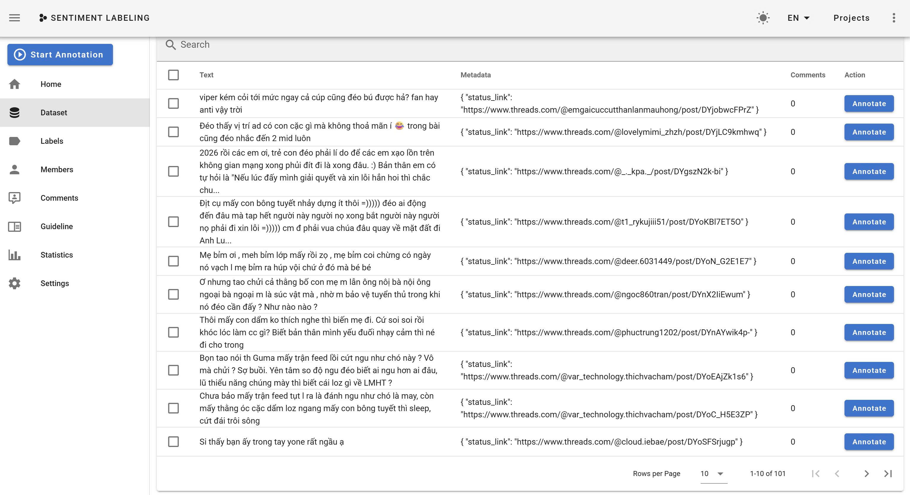
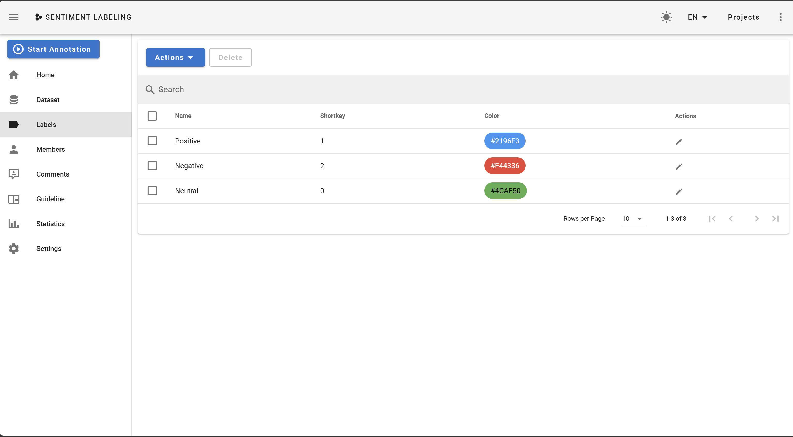
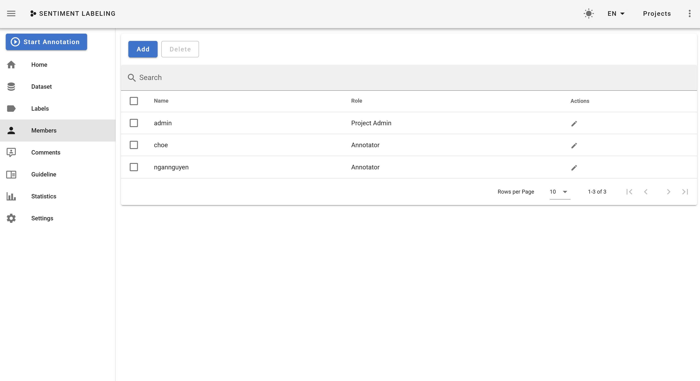
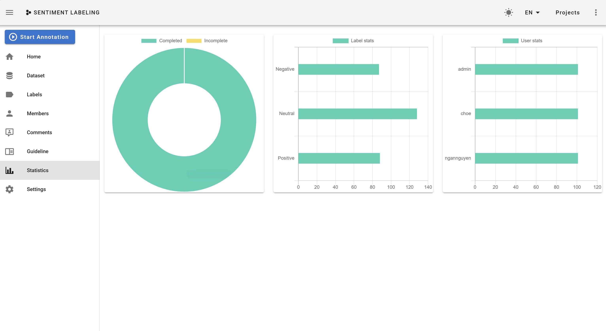

# BÀI THỰC HÀNH 6: TÌM HIỂU VÀ SỬ DỤNG CÔNG CỤ GÁN NHÃN

## Thành viên nhóm

- **Phạm Đình Quang Huy** - MSSV: 24520689
- **Phạm Ngọc Minh** - MSSV: 24521082
- **Nguyễn Thị Kim Ngân** - MSSV: 24521130

## Mô tả project

Project này dùng để:

- Hợp nhất kết quả gán nhãn từ nhiều người gán nhãn (annotators).
- Phân tích độ đồng thuận bằng chỉ số Cohen’s Kappa.
- Tính toán Kappa cho từng cặp (Pairwise Kappa) và Kappa trung bình.
- Phân tích các trường hợp không đồng nhất (disagreement analysis).
- Trực quan hóa kết quả thông qua Confusion Matrix.

---

## Cấu trúc thư mục

```text
LAB5/
│
├── data/
│   ├── raw/                   # Chứa file gán nhãn thô của từng thành viên
│   │   ├── choe.csv           # File gán nhãn của Minh
│   │   ├── huy.csv            # File gán nhãn của Huy
│   │   └── nganguyen.csv      # File gán nhãn của Ngân
│   │
│   └── processed/             # Chứa dữ liệu đã được hợp nhất
│       └── merged_annotations.csv
│
├── notebooks/                 # Quy trình xử lý dữ liệu
│   ├── 01_merge_annotations.ipynb    # Hợp nhất dữ liệu gán nhãn
│   └── 02_agreement_analysis.ipynb   # Phân tích độ đồng thuận
│
├── outputs/                   # Kết quả phân tích
│   ├── disagreement_files/    # Các file CSV lưu trường hợp không đồng nhất
│   └── confusion_matrices/    # Hình ảnh ma trận nhầm lẫn
│
├── requirements.txt           # Các thư viện cần thiết
└── README.md                  # Tài liệu hướng dẫn
```

---

# Dataset Format

Mỗi file annotator phải có format:

| id  | data         | label    |
| --- | ------------ | -------- |
| 1   | example text | positive |

---

## Quy trình thực hiện (Workflow)

### 1. Thu thập dữ liệu và gán nhãn

Nhóm đã sử dụng tiến hành gán nhãn thông qua hệ thống Doccano:

<p align="center">
  <br>
  <em>Figure 1: Dataset</em>
</p>

<p align="center">
  <br>
  <em>Figure 2: Label</em>
</p>

<p align="center">
  <br>
  <em>Figure 3: Members</em>
</p>

<p align="center">
  <br>
  <em>Figure 4: Statistics</em>
</p>

### 2. Hợp nhất nhãn (Merge Annotations)

**Notebook:** `01_merge_annotations.ipynb`

- Đọc dữ liệu từ các file CSV thô.
- Chuẩn hóa tên cột nhãn theo từng annotator.
- Hợp nhất (merge) tất cả nhãn vào một file duy nhất để phục vụ phân tích.

### 3. Phân tích độ đồng thuận (Agreement Analysis)

**Notebook:** `02_agreement_analysis.ipynb`

- **Tính toán Cohen’s Kappa:** Đo lường độ đồng thuận giữa 2 người gán nhãn, loại bỏ yếu tố ngẫu nhiên.
- **Phân tích cặp:** So sánh (Huy vs Ngân), (Huy vs Choe), (Ngân vs Choe).
- **Đánh giá:** Tính Kappa trung bình cho toàn bộ nhóm.
- **Trực quan hóa:** Vẽ Confusion Matrix để xác định các nhãn thường bị nhầm lẫn.
- **Trích xuất sai sót:** Lưu các dòng dữ liệu có sự mâu thuẫn giữa các annotators để xem xét lại guideline.

## Hướng dẫn cài đặt và chạy

### Cài đặt môi trường

```bash
pip install -r requirements.txt
```

---

### Chạy phân tích

Mở Jupyter Notebook hoặc VSCode và chạy tuần tự các file trong thư mục `notebooks/`.

---

## Công thức tính toán

**Chỉ số Cohen’s Kappa:**

$$
\kappa = \frac{P_o - P_e}{1 - P_e}
$$

_Trong đó:_

- $P_o$: Tỷ lệ đồng thuận quan sát được (Observed Agreement).
- $P_e$: Tỷ lệ đồng thuận ngẫu nhiên (Expected Agreement).

**Kappa trung bình (Average Pairwise Kappa):**

$$
\bar{\kappa} = \frac{\kappa_{1,2} + \kappa_{1,3} + \kappa_{2,3}}{3}
$$

---

## Kết quả

Kết quả sau khi nhóm gán nhãn và đánh giá bằng Cohen's Kappa được thể hiện trong bảng sau:

| Độ đồng thuận | Cohen's Kappa | Landis và Koch |
| ------------- | ------------- | -------------- |
| Total         | 0.6323        | substantial    |
| huy vs ngan   | 0.5004        | moderate       |
| huy vs minh   | 0.6381        | substantial    |
| ngan vs minh  | 0.7583        | substantial    |

**Nhận xét:**

- Về tổng thể: Độ đồng thuận chung của toàn nhóm đạt mức Substantial (Đáng kể) với hệ số $Kappa = 0.6323$. Kết quả này chứng tỏ bộ dữ liệu có độ tin cậy ổn định, đạt yêu cầu để đưa vào sử dụng hoặc huấn luyện mô hình, dù vẫn còn dư địa để cải thiện.

- Về chi tiết giữa các thành viên:
  - Có sự đồng thuận rất cao giữa ngan vs minh ($0.7583$), cho thấy hai annotator này có sự thống nhất lớn trong việc áp dụng quy định gán nhãn.
  - Tuy nhiên, độ đồng thuận thấp nhất rơi vào cặp huy vs ngan ($0.5004$ - mức Moderate). Điều này chỉ ra rằng annotator Huy đang có sự khác biệt đáng kể trong tiêu chí đánh giá hoặc cách hiểu ngữ cảnh so với Ngân (và một phần so với Minh).
- Nguyên nhân và giải thích:
  - Mặc dù nhóm đã có guideline hướng dẫn, nhưng một số trường hợp dữ liệu mang tính mập mờ (ambiguous) hoặc phụ thuộc nhiều vào ngữ cảnh phức tạp, dẫn đến việc mỗi annotator tự suy luận theo thế giới quan cá nhân.
  - Guideline có thể còn một số "vùng xám" chưa bao phủ hết các trường hợp đặc biệt, khiến cặp Huy vs Ngân có cách xử lý trái ngược nhau.

---

## Ý nghĩa và Kết luận

Thông qua bài thực hành gán nhãn và đánh giá bằng Cohen's Kappa, nhóm rút ra các kết luận cốt lõi sau:

- **Về chất lượng dữ liệu:** Độ đồng thuận tổng thể đạt mức _Substantial_ ($0.6323$), chứng minh tập dữ liệu có độ tin cậy, đảm bảo tính nhất quán trung bình.

- **Về tài liệu hướng dẫn:** Sự chênh lệch giữa các cặp gán nhãn (thấp nhất là $0.5004$) chỉ ra Guideline vẫn còn điểm chưa rõ ràng, dễ gây hiểu lầm dựa trên ngữ cảnh.

- **Hướng tối ưu:** Kết quả này là cơ sở để nhóm tiến hành họp giải quyết các nhãn mâu thuẫn, đồng thời cập nhật, làm rõ Guideline nhằm chuẩn hóa dữ liệu cho các giai đoạn tiếp theo.
